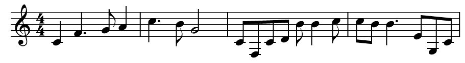

Genetic Sonata-Allegro Composition
==================================

The following image is a single theme generated by the Genetic Sonata-Allegro composer. For a full composition, see the end of this file.

## Running

There are three targets provided. These can be compiled with `lein uberjar`, or run separately using leiningen (obtained from [Leiningen](http://leiningen.org)).

#### Genetic Algorithm

To generate a song run `lein ga <outfile>`.

For example, `lein ga awesome.song`.

#### Playback

To play a generated song that was saved to a file, run `lein play <file> <key1> <key2> <mode> <bpm>`.

For example, `lein play awesome.song E E major 80`.

#### MIDI

To generate a midi file of the melodic line of a composition, run `lein midi <infile> <outfile>`.

For example, `lein midi awesome.song awesome.mid`. The generated midi can be loaded into notation or composition software to be edited and cleaned, or to play back in a customized manner.

#### Example Compositions

There are many example compositions from a run in the `song/` directory. These can be used as the files in the Playback and MIDI sections.

## Introduction

This project applies genetic algorithms to the creation of sonata-allegro piano compositions. The goal is to apply a non-interactive genetic algorithm to both melody and rhythm generation within the bounds of a well defined and widely used structural form. The structural setting will allow the generated music to have thematic recall without the need for human interactive fitness evaluation. Many evolutionary music generation projects, such as GenJam, use an interactive approach to evaluate the fitness of generated melodies. Although this allows greater emotional control over the music, and the possibility to award thematic development when heard, interactive genetic algorithms are constrained by the requirement of a human user. The well defined Sonata-Allegro structure will allow melodies to be generated automatically, and have a minimum thematic presence that is outlined below.

## Background

A basic sonata allegro form movement has several components:

* A primary theme (T1)
* A secondary theme (T2)
* A development (D)

There can be other sections added to fill out the composition, such as a coda, but these three components are minimally necessary. In Sonata-Allegro form, these components are fit together in a well defined fashion:

    | T1 T2 :| D | T1 T2 |

The first two themes are played and repeated. A development follows. The development section builds on the ideas presented in the first two themes, while also presenting new ideas itself. The development section can have small thematic material within, independent of the original two themes. Finally, the original two themes are repeated to draw the composition to a conclusion with familiar material.

This composition style is used as the structure of the first movement in most western classical and romantic symphonies.

## Genetic Algorithm

### Genotype Encoding

The genetic algorithm is concious of musical ideas in order to eliminate areas of the search space so that interesting melodies can be evolved without searching wading through possible solutions that will sound dissonant by definition. In the style of GenJam, the genotype is a string of integers such as

    0 1 2 3 4 5 6 7

When decoded, each integer represents semitone interval away from the tonic (the root of the scale that is specified by the user). For example, the string presented above would represent an increasing scale over a single octave. When decoded, each integer is interpreted as a base length which is specified by the user. By default, the base length is an eighth note. This represents the smallest length that a note can have. To construct notes of different length, a HOLD value is also present for the genotype. As an example, the above scale in eighth notes would be converted to a quarter note scale by adding an eighth note hold after each note.

    0 HOLD 1 HOLD 2 HOLD 3 HOLD 4 HOLD 5 HOLD 6 HOLD 7 HOLD

Thus, the domain of values for the encoding are

    [-8, 8] U HOLD

This allows the possible use of just over two full octaves and all note lengths that are multiples of an eighth note (eighth, quarter, half, whole, etc).

### Populations

Following Sonata-Allegro form, a minimum of three populations are used. One population for each theme, and a third for the development. Each theme population consists of some number of phrases encoded with the encoding scheme outlined above. A phrase is defined to be four measure which is equal to 8 * 4, or 32, integers per individual in the population. A development population uses the same encoding, but the individuals encode eight measures rather than four.

### Crossover

Standard one-point crossover between two parents is used to generate two children. A random position in the encoding is chosen. Elements from the first parent before the chosen point and the elements from the second parent after the chosen point are used to construct one child. Similarly, the opposite elements are used to construct the second child.

### Selection

A standard tournament selection with a tournament size of four is used to select two individuals in the population for breeding. This is repeated `popsize / 2` times each generation since the crossover operation generates two children per crossover. This maintains a constant population size throughout generations.

### Mutation

Several mutation strategies are available, and are applied by default at a rate of 30%. 

First, as a means of introducing and removing `HOLD`s from an individual, `invert-rhythm` will loop over the entire individual and flip a note to a HOLD or a HOLD to a random note with a chance of 20% per element.

To aid in the creation of intervallic movement two mutations appearing in GenJam are used. The first replaces a random substring from an individual with an ascending version. The second, similarity, replaces a substring with a descending version.

Two similar choose a random substring from an individual in the same way as the sorting mutation. However, each element in the substring is either incremented a random amount, or decremented a random amount, depending on the mutation operation.

### Fitness

The fitness criteria is responsible for driving the convergence of the algorithm to pleasant sounding compositions. There are several criteria specified, with each criteria weighted by an associated weighting. The two themes are generated independently, using only fitness criteria focussed on the individual theme candidates. On the other hand, in order for the development section to use ideas presented in the thematic opening, there must be some fitness criteria to award for using thematic material. This is done with, in addition to the criteria used to generate the themes themselves, the addition of the resemblance of sections of the development with both of the two themes. Thus, the two themes are generated first, using separate genetic algorithms, and separate initial populations in order to avoid genetic overlap, followed by the generation of a development whose fitness uses the two generated themes. Finally, chord rhythms are generated for each component independently.

#### Theme and Development Fitness Criteria

In order to avoid random rhythms, an individual is penalized for each rest at an even-valued position. The fittest individual in this criteria would be one with a greatest presence of rests during off-beat times so that notes appear on-beat.

#### Development-Only Fitness Criteria

#### Chord Fitness Criteria

## Result

The end result is a full Sonata-Allegro composition consisting of two themes and a development. The following image is the output of one run.

## Playback

The generated compositions can be played using the internal mechanism, which will play a composition with a sampled piano from freesounds.org. Alternatively, the composition melodic line can be written to a midi file, and imported into composition software for cleaning, editing, or customized playback.

